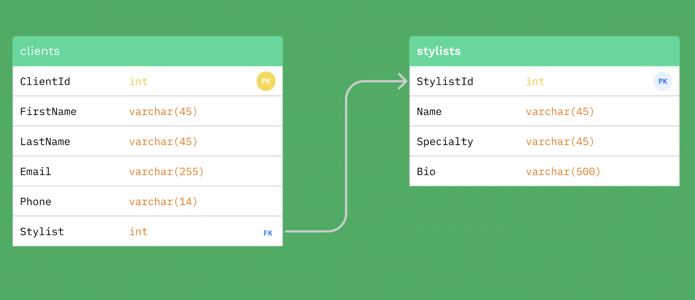

# Hair Salon

#### By Kirsten Opstad

#### An MVC web app to manage stylists and clients for a fictional hair salon

## Technologies Used

* C#
* .Net 6
* ASP.Net Core 6 MVC
* EF Core 6
* SQL
* MySQL
* MySQL Workbench
* LINQ

## Description

### Objectives (MVP)

#### Eau Claire's Salon
You've been referred by Pierre to his friend Claire who is the owner of a hair salon called Eau Claire's Salon. She has contracted you out to create an MVC web application to help her manage her employees (stylists) and their clients. Claire should be able to add a list of stylists working at the salon, and for each stylist, add clients who see that stylist. The stylists have specific specialties, so each client can only see (belong to) a single stylist.

#### User Stories
  * As the salon owner, I need to be able to see a list of all stylists. ✅
  * As the salon owner, I need to be able to select a stylist, see their details, and see a list of all clients that belong to that stylist. ✅
  * As the salon owner, I need to add new stylists to our system when they are hired. ✅
  * As the salon owner, I need to be able to add new clients to a specific stylist. I should not be able to add a client if no stylists have been added. ✅

### Outline

1. Stylists 
  - Index [READ] ✅
  - Details [READ] ✅
  - Create [UPDATE] ✅

2. Clients 
  - Index [READ] ✅
  - Details [READ] ✅
  - Create [UPDATE] ✅

#### Naming
Note: You must follow the naming conventions for your project. Projects that do not follow these conventions will not be reviewed and will be returned not passing.

Use your first name and last name to name your database in the following way:

Production Database: first_last
Use the following name for your directory:

Main Project Folder: HairSalon

#### Exported Database
When you're finished, export the .sql file holding the information from your production database.

Please commit this file with your project in the top level of your solution folder. Again, use your first and last name as the file name following the pattern below:

Production Database: first_last.sql
If you name your database, project folder, or .sql file incorrectly your project will be sent back to you immediately without being graded.

#### Additional Objectives
Your code will be reviewed for the following objectives:

* Do the database table and column names follow proper naming conventions?
* Do the project folder and exported database follow the specific naming requirements for this project?
* Is there a one-to-many relationship set up correctly in the database?
* Is CREATE functionality included for one class and is CREATE and VIEW functionality included for the other class?
* Is EF Core used for communication with the database?
* Build files and sensitive information are included in .gitignore file and is not to be tracked by Git, and includes instructions on how to create the appsettings.json and set up the project.
* Project is in a polished, portfolio-quality state.
The prompt’s required functionality and baseline project requirements are in place by the deadline.




<!-- [Link to operational site](http://www.kirstenopstad.github.com/<REPOSITORY NAME>) -->

### Goals
1. Meet MVP ✅
2. Include a form where employees may search for a stylist by name. ✅
3. Display a list of all results. ✅
Include a form where employees may also search for a client by name. Display a list of all results. ✅
4. Add a feature for adding an appointment to a client.
5. Add a feature for adding an appointment to a stylist. Add a check to make sure the stylist does not have any conflicting appointments.
6. Add a feature for keeping track of how much each stylist was paid for each appointment.
7. Add styling to your page.

## Setup/Installation Requirements

#### Get copy of MySQL database
1. Clone this repo to your workspace.
2. Open MySQLWorkbench [Click here for instructions to download]
3. Under Administration Tab, select Data Import/Restore
  * Select 'Import from Self Contained File'
  * Select ../kirsten_opstad.sql from the project root directory
  <!--  -->
  * Select "New..." and set new schema name to **kirsten_opstad**
  * Select 'Start Import'
4. You should now have a copy of the **kirsten_opstad** database on your machine.

#### Open project
1. Navigate to the **HairSalon** directory.
2. Create a file named `appsettings.json` with the following code. Be sure to update the Default Connection to your MySQL credentials.
```
{
  "ConnectionStrings": {
    "DefaultConnection": "Server=localhost;Port=3306;database=kirsten_opstad;uid=[YOUR-USERNAME-HERE];pwd=[YOUR-PASSWORD-HERE];"
  }
}
```
3. Install dependencies within the **HairSalon** directory
```
$ dotnet restore
````

4. To build & run program in development mode 
 ```
 $ dotnet run
 ```

5. To build & run program in production mode 
 ```
 dotnet run --launch-profile "production"
 ```

## Known Bugs

* No known bugs. If you find one, please email me at kirsten.opstad@gmail.com with the subject **[_Repo Name_] Bug** and include:
  * BUG: _A brief description of the bug_
  * FIX: _Suggestion for solution (if you have one!)_
  * If you'd like to be credited, please also include your **_github user profile link_**

## License

MIT License

Copyright (c) 2022 Kirsten Opstad 

Permission is hereby granted, free of charge, to any person obtaining a copy of this software and associated documentation files (the "Software"), to deal in the Software without restriction, including without limitation the rights to use, copy, modify, merge, publish, distribute, sublicense, and/or sell copies of the Software, and to permit persons to whom the Software is furnished to do so, subject to the following conditions:

The above copyright notice and this permission notice shall be included in all copies or substantial portions of the Software.

THE SOFTWARE IS PROVIDED "AS IS", WITHOUT WARRANTY OF ANY KIND, EXPRESS OR IMPLIED, INCLUDING BUT NOT LIMITED TO THE WARRANTIES OF MERCHANTABILITY, FITNESS FOR A PARTICULAR PURPOSE AND NONINFRINGEMENT. IN NO EVENT SHALL THE AUTHORS OR COPYRIGHT HOLDERS BE LIABLE FOR ANY CLAIM, DAMAGES OR OTHER LIABILITY, WHETHER IN AN ACTION OF CONTRACT, TORT OR OTHERWISE, ARISING FROM, OUT OF OR IN CONNECTION WITH THE SOFTWARE OR THE USE OR OTHER DEALINGS IN THE SOFTWARE.
